# 基于springboot的校园社团信息管理

#### 介绍

基于SpringBoot的校园社团信息管理系统旨在为高校的社团管理提供一个高效、便捷的信息化平台。该系统通过系统化的管理功能，实现社团信息、成员信息、活动信息的全面管理，促进社团活动的有序开展和学生参与社团的积极性。系统分为管理端、社长端和学生端三个角色，各自拥有不同的功能模块，确保系统的安全性和使用的便捷性。

#### 技术栈

后端技术栈：Springboot+Mysql+Maven

前端技术栈：Vue+Html+Css+Javascript+ElementUI

开发工具：Idea+Vscode+Navicate

#### 系统功能介绍

管理端功能模块：  
个人中心：管理员可以管理个人信息，修改密码等，确保账户安全。  
学生管理：管理学生的注册信息，包括新增、编辑、删除学生信息。  
社长管理：管理社长的注册信息和权限分配，确保社团领导层的合规管理。  
社团分类管理：管理社团的分类，方便学生按类别查找和加入社团。  
社团信息管理：录入和管理社团的基本信息，包括社团名称、简介、成立时间等。  
加入社团管理：管理学生加入社团的申请，审核和处理申请信息。  
社团成员管理：管理每个社团的成员信息，记录成员的活动参与情况等。  
社团活动管理：管理各个社团的活动信息，包括活动名称、时间、地点、参与人员等。  
活动报名管理：管理学生报名参加社团活动的信息，审核和处理报名信息。  
系统管理：进行系统的整体管理和维护，包括系统设置、数据备份和恢复等功能。  

社长端功能模块：  
社团信息：查看和管理自己社团的基本信息，发布和更新社团动态。  
社团活动：发布和管理社团活动信息，包括活动详情、时间、地点等。  
社团新闻：发布和管理社团的新闻资讯，宣传社团活动和成果。  
个人中心：管理个人信息，修改密码等，确保账户安全。  
后台管理：  
社团信息管理：录入和管理社团的基本信息。  
加入社团管理：管理学生加入社团的申请，审核和处理申请信息。  
社团成员管理：管理社团成员信息，记录成员的活动参与情况等。  
社团活动管理：管理社团活动信息，包括活动名称、时间、地点、参与人员等。  
活动报名管理：管理学生报名参加社团活动的信息，审核和处理报名信息。  

学生端功能模块：  
社团信息：浏览各个社团的详细信息，了解社团的基本情况和动态。  
社团活动：查看和报名参加社团活动，了解活动详情和安排。  
社团新闻：浏览社团发布的新闻资讯，了解社团活动和成果。  
个人中心：管理个人信息，修改密码等，确保账户安全。  
后台管理：  
加入社团管理：管理自己申请加入社团的信息，查看审核状态。  
活动报名管理：管理自己报名参加社团活动的信息，查看审核状态和活动安排。  
我的收藏管理：管理个人收藏的社团信息和活动，方便快速访问。  

#### 系统作用

提升管理效率：通过信息化手段，实现社团信息、成员信息、活动信息的全面管理，简化了管理员和社长的工作流程，提高了管理效率。  
促进社团发展：系统化的管理功能，帮助社团更好地开展活动，吸引更多学生参与，促进社团的健康发展。  
增强学生参与度：学生可以方便地浏览社团信息和活动，在线报名参加社团活动，提高了学生参与社团的积极性。  
信息透明化：系统实时更新社团动态和活动信息，确保所有相关人员都能及时获取最新信息，增强了信息的透明度。  
数据安全性：通过完善的权限管理和数据备份功能，确保系统数据的安全性和可靠性。  

#### 系统功能截图

代码结构

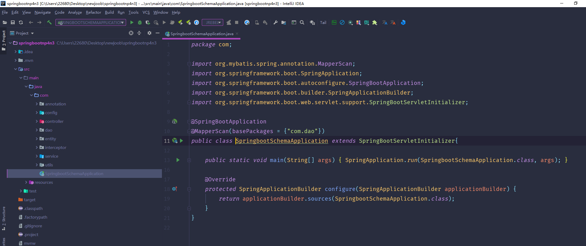

数据库表

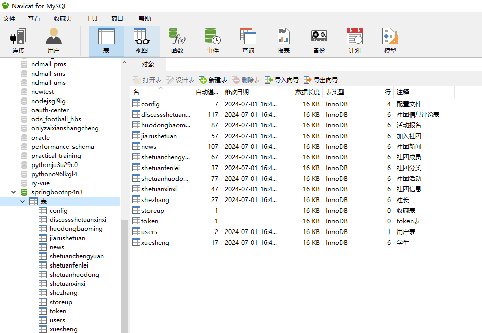

登录

前台页面首页

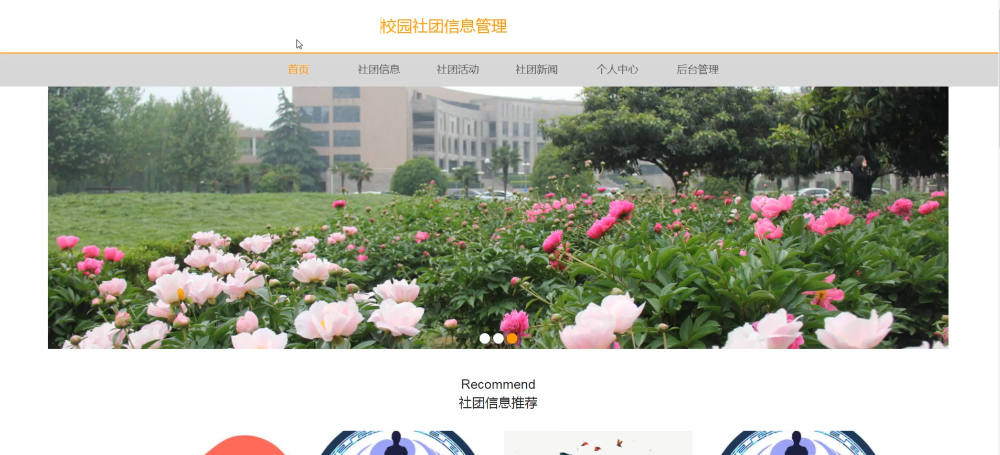

社团信息管理

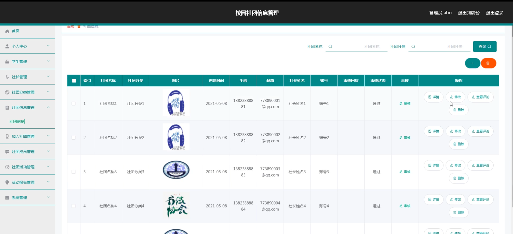

系统管理

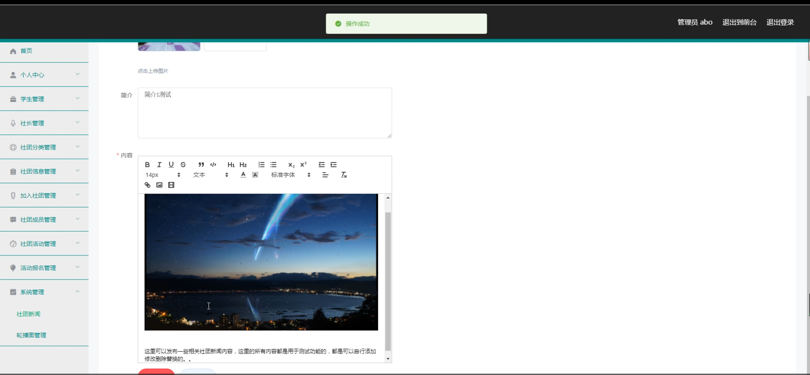

社长端社团信息

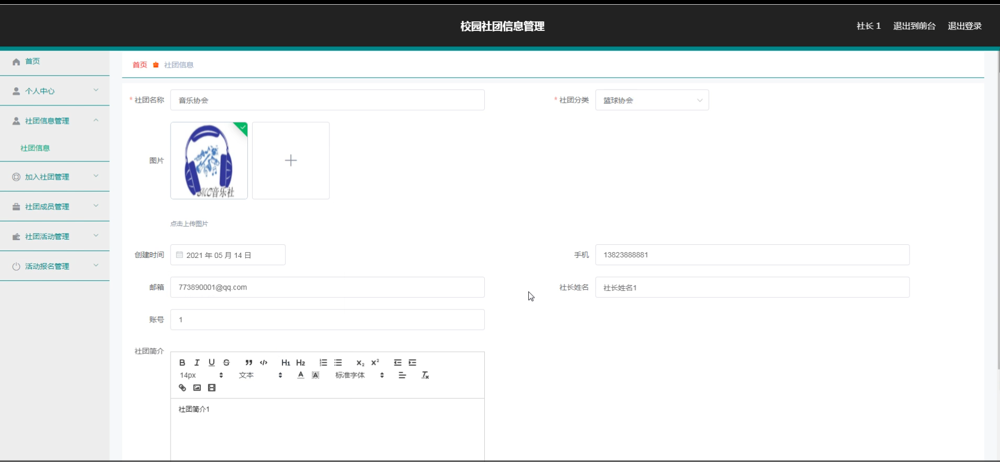

社团成员管理

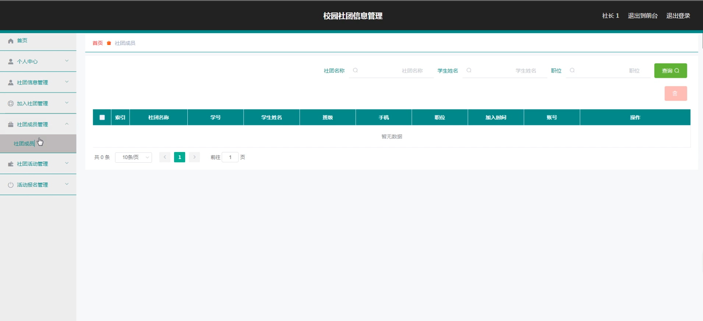

活动报名管理

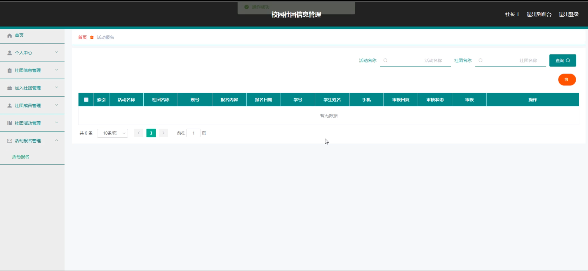

社团新闻

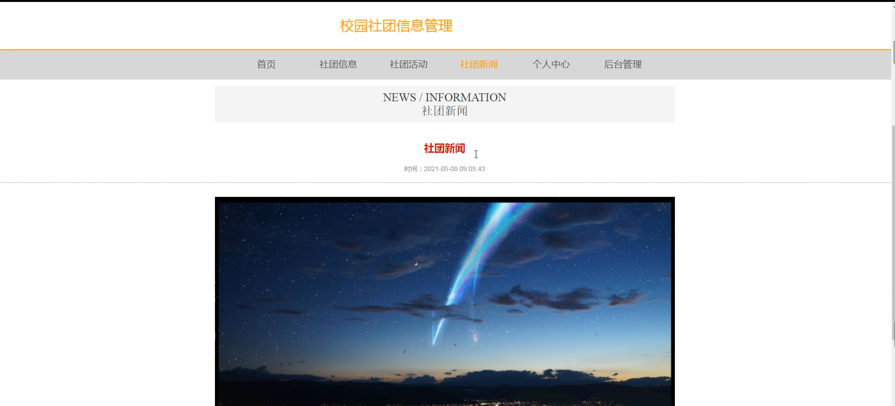

个人中心

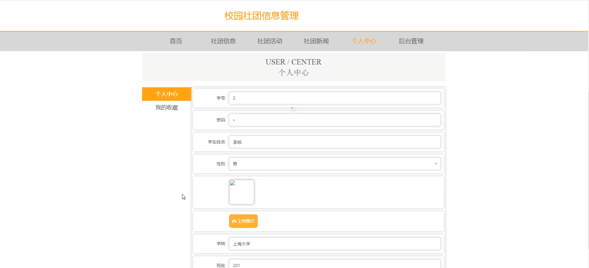

学生端后台管理

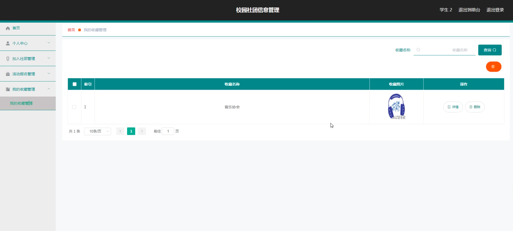

#### 总结

基于SpringBoot的校园社团信息管理系统，通过精细化、系统化的功能设计，为高校社团管理提供了一个高效、便捷的信息化平台。系统不仅提高了社团管理的效率和透明度，也增强了学生参与社团的积极性和互动交流。管理员、社长和学生各自拥有完善的功能模块，确保系统的安全性和使用的便捷性。该系统的开发和应用，将为高校社团的发展提供强有力的技术支持，助力学生全面发展和校园文化建设。

#### 使用说明

创建数据库，执行数据库脚本 修改jdbc数据库连接参数 下载安装maven依赖jar 启动idea中的springboot项目

后台地址：http://localhost:8080/springbootnp4n3/admin/dist/index.html

管理员  abo 密码 abo

前台地址：http://localhost:8080/springbootnp4n3/front/index.html
